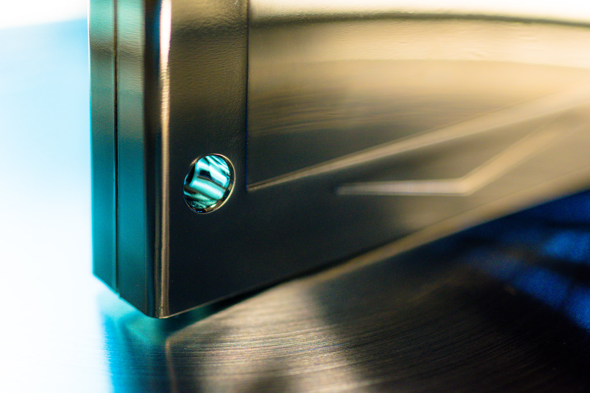

# mgLunch4Lux
Launcher for mgLux (LuxuryBox)

mgLunch! is a MSX ROM launcher for LuxuryBox

v1.2f :

      1. task switching module's were fixed. 
         no longer necessary  "*.tmp", "__lunch__.com" files

      2. execute option presetting issue's were fixed. 
         option toggle switching function. 
   
      3. and. . . a few thousand bugs were killed by my f**ing gun. ^^

USAGE

- mgLunch.com - mgLunch! for LuxuryBox
- mglUx.com  - romloader for LuxuryBox
- mglCook.exe - rom file scanner for Windows xp/vista/7/8/8.1/10 

      [F1] Search : Search Rom File 
      [F2] FavBnk : Change to Favorite section
      [F3] AddFav : Add to Favorite
      [F4] RmvFav : Remove from Favorite
      [F5] Help 
      [F10] Exit to DOS
      [SPACE] : File Select Mode
      [0]~[Z] : Fast Change File Section
      [CTRL]+[CURSOR] : Fast Cursor Scroll

...And more some command options are as below in 'File Select Mode' 

      [RETURN] = Execute Rom file
      [k] = forced execute rom on Konami classic Mapper - faster than autodetect
      [s] = forced execute rom on Konami-SCC Mapper - faster than autodetect
      [8] = forced execute rom on Ascii-8 Mapper - faster than autodetect
      [f] = forced execute rom on Ascii16 Mapper - faster than autodetect
      [t] = R800/Panasonic-Z80b Turbo mode
      [o] = game master option
      [q] = disable MMC/SD(v2.0) cartridge. 

REQUIREMENTS

      MSXDOS2, Nextor 
      

'mgLunch' , "mglUx", "mglCook" are written by ToughkidCST

CONTACT
toughkiddev@gmail.com

Youtube Video Links

- https://www.youtube.com/watch?v=PuNxzULH6jQ&list=PLlD0W14KLTkpq5dnONr_U6fAUWuyGliEw&index=8
- https://www.youtube.com/watch?v=2cmA5ZL4a7k&list=PLlD0W14KLTkpq5dnONr_U6fAUWuyGliEw&index=75
- https://www.youtube.com/watch?v=7YDBAJa8rag&list=PLlD0W14KLTkpq5dnONr_U6fAUWuyGliEw&index=76

